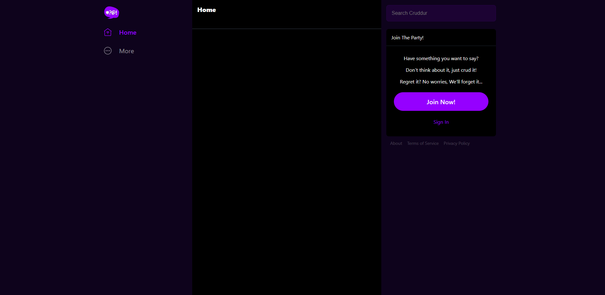
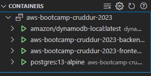
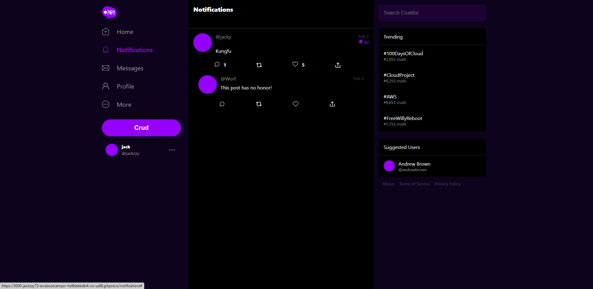

# Week 1 — App Containerization

## Containerize Backend

- create Dockerfile and build docker
- unlock the port and open the link for 4567 in my browser
- append to the url to `/api/activities/home`
- get back the following result

    [
    {
        "created_at": "2023-02-22T22:50:58.963490+00:00",
        "expires_at": "2023-03-01T22:50:58.963490+00:00",
        "handle": "Andrew Brown",
        "likes_count": 5,
        "message": "Cloud is fun!",
        "replies": [
        {
            "created_at": "2023-02-22T22:50:58.963490+00:00",
            "handle": "Worf",
            "likes_count": 0,
            "message": "This post has no honor!",
            "replies_count": 0,
            "reply_to_activity_uuid": "68f126b0-1ceb-4a33-88be-d90fa7109eee",
            "reposts_count": 0,
            "uuid": "26e12864-1c26-5c3a-9658-97a10f8fea67"
        }
        ],
        "replies_count": 1,
        "reposts_count": 0,
        "uuid": "68f126b0-1ceb-4a33-88be-d90fa7109eee"
    },
    {
        "created_at": "2023-02-17T22:50:58.963490+00:00",
        "expires_at": "2023-03-05T22:50:58.963490+00:00",
        "handle": "Worf",
        "likes": 0,
        "message": "I am out of prune juice",
        "replies": [],
        "uuid": "66e12864-8c26-4c3a-9658-95a10f8fea67"
    },
    {
        "created_at": "2023-02-24T21:50:58.963490+00:00",
        "expires_at": "2023-02-25T10:50:58.963490+00:00",
        "handle": "Garek",
        "likes": 0,
        "message": "My dear doctor, I am just simple tailor",
        "replies": [],
        "uuid": "248959df-3079-4947-b847-9e0892d1bab4"
    }
    ]

## Containerize Frontend

- create Dockerfile and build docker
- unlock the port and open the link for 3000 in my browser
- get back the following result

## Multiple Containers

- create Docker-compose.yml and compose-up
- both Backend and Frontend containers are working

## Add DynamoDB local

- Add DynamoDb code into dock-compose.yml
- Test Dynamodb with sample commands

## Add Postgres

- Add Postgres code into dock-compose.yml
- Test Postgres with Posdtgres client and VS code PostreSQL extension

## Final Dock-compose result

## Complete Notification Page 
- Modify openapi-3.0.yml
- Modify and create backend python code for notification activities
- Modify and create frontend js code for notification page

# Final Result

