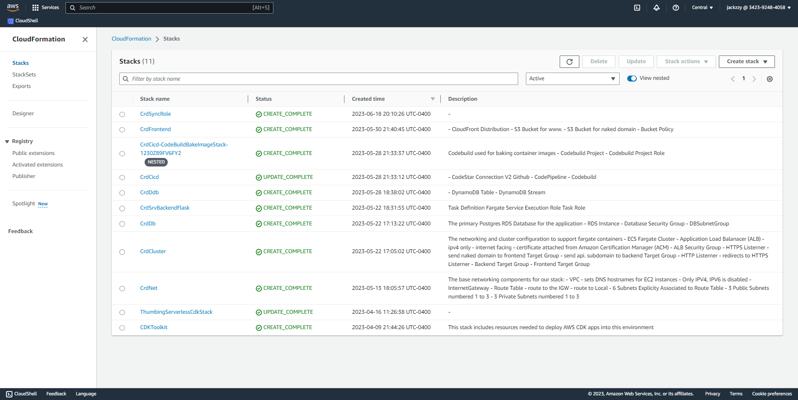

# Week 10 — CloudFormation

### - CFN Networking Layer

### - CFN Cluster Layer

### - CFN Service Layer for Backend

### - CFN Database Layer (RDS)

### - DynamoDB using SAM

### - CFN CI/CD

### - CFN Static Website Hosting for Frontend

