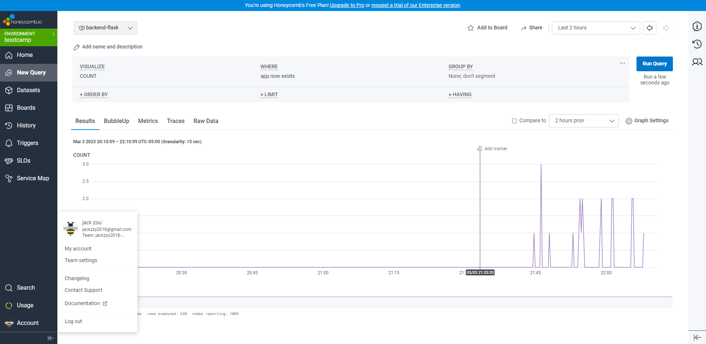
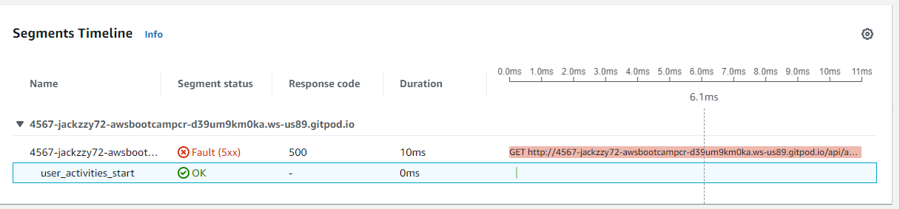
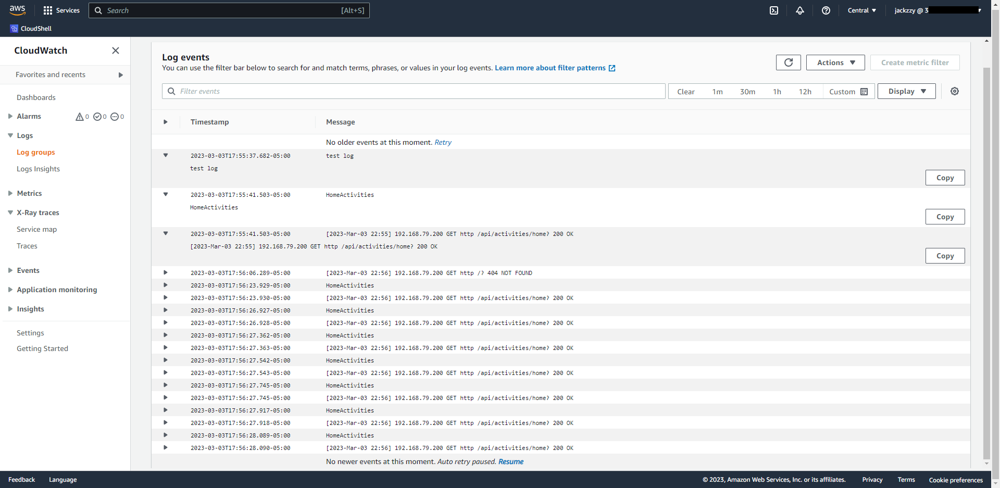
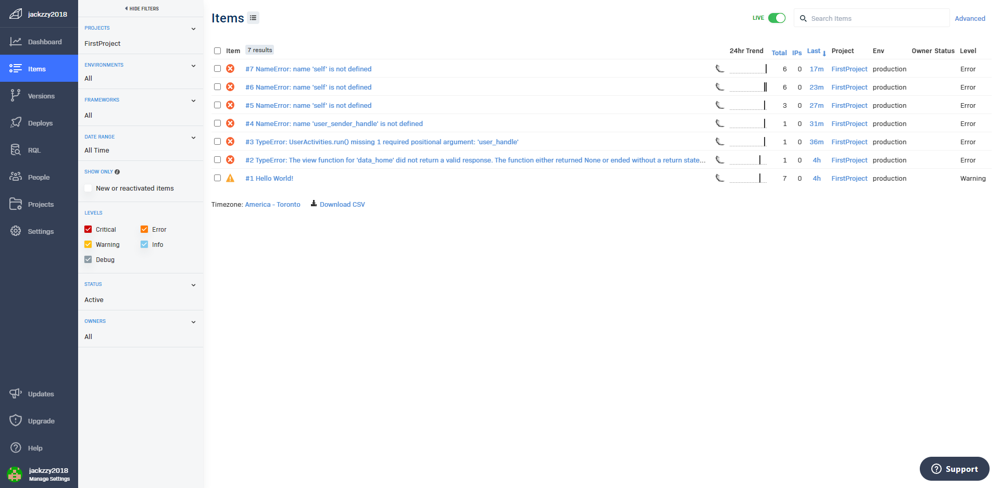

# Week 2 — Distributed Tracing

## Honeycomb
create span in the tracer

## AWS X-Ray
Subsegment is not working properly.

## AWS Cloudwatch
Follow video to implement the Cloudwatch

## Rollbar
Setup of testing endpoint to testing rollbar
Catch code error when trying to implement X-Ray Subsegment.
