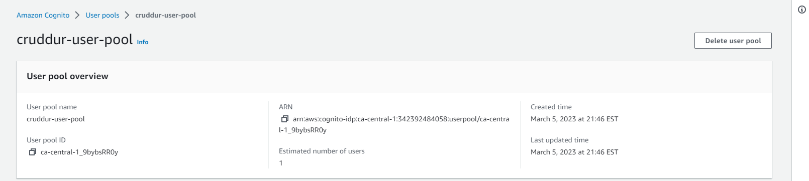
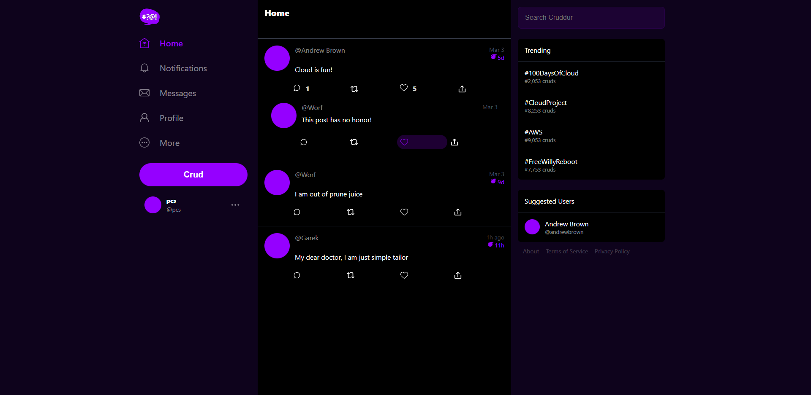
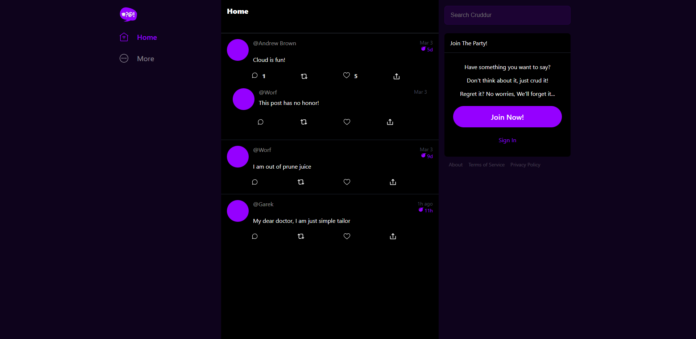

# Week 3 — Decentralized Authentication

## Install AWS Amplify

## Provision Cognito User Group in AWS console


## Config Amplify - modify code in app.js to hook up cognito pool

## Conditionally show components based on Logged in or Logged out
### Log in screenshot



### Log in screenshot



## Modify code for Signin Page, Signout Page , Confirmation Page and Recovery Page


## Transfer Auth token from frontend to backend
- Add headers in the 'HomeFeedpage.js' 
- add cors code in app.py
- add debug code to check if we recieve the auth headers. 
   ````
    app.logger.debug(
       request.headers.get('Authorization')
    )

## Jwt token code
- add new cogenito_jwt_token.py under lib folder
- modify app.py
- modify code in home_activites.py to add arguement to Run(cognito_user_id=None)
- add extra code in home_activites.py to
```
   if cognito_user_id != None:
        extra_crud = {
          'uuid': '248959df-3079-4947-b847-9e0892d1bab4',
          'handle':  'Jack',
          'message': 'My dear brother pcs, it the humans that are the problem',
          'created_at': (now - timedelta(hours=1)).isoformat(),
          'expires_at': (now + timedelta(hours=12)).isoformat(),
          'likes': 1042,
          'replies': []
        }
        results.insert(0,extra_crud)


