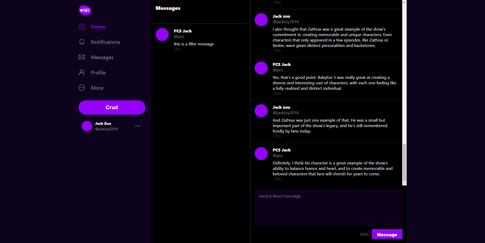
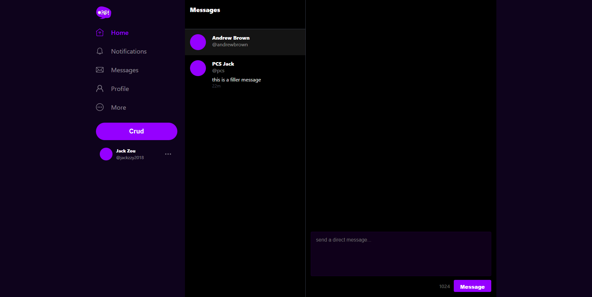
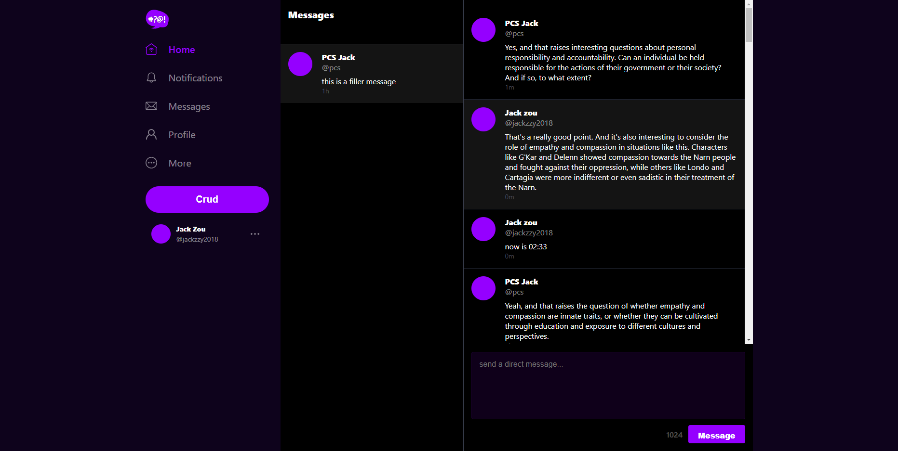
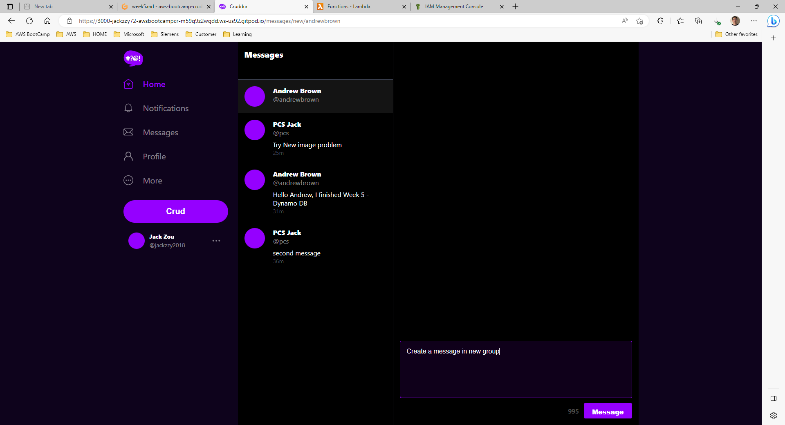
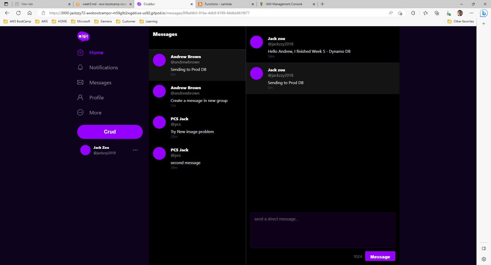
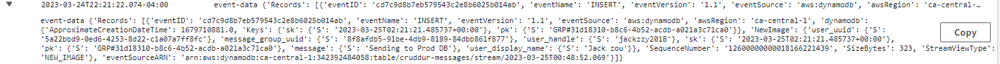

# Week 5 — DynamoDB and Serverless Caching

## Implement Dynamo DB Scripts

## Implement Update Cognito ID Script for Postgres Database

## Implemnet Conversations with Dynamo DB

### Pattern A - Listing messages in Message Group

### Pattern B - Listing message group in Application

### Pattern C - Creating a message for an existing Message Group into Application

### Pattern D - Creating a message for an new Message Group into Application

### Pattern E - Updating a message group using Dynamo DB Streams

