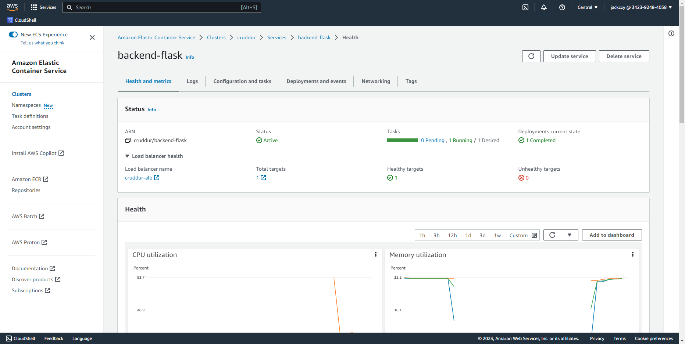
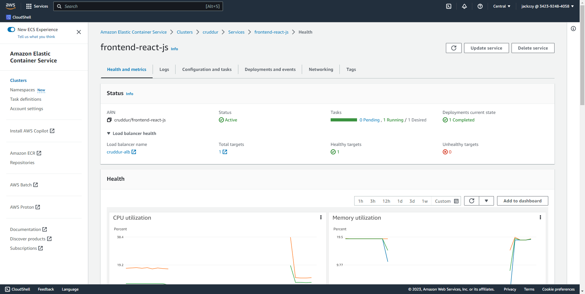
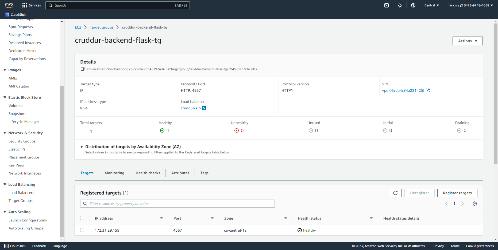
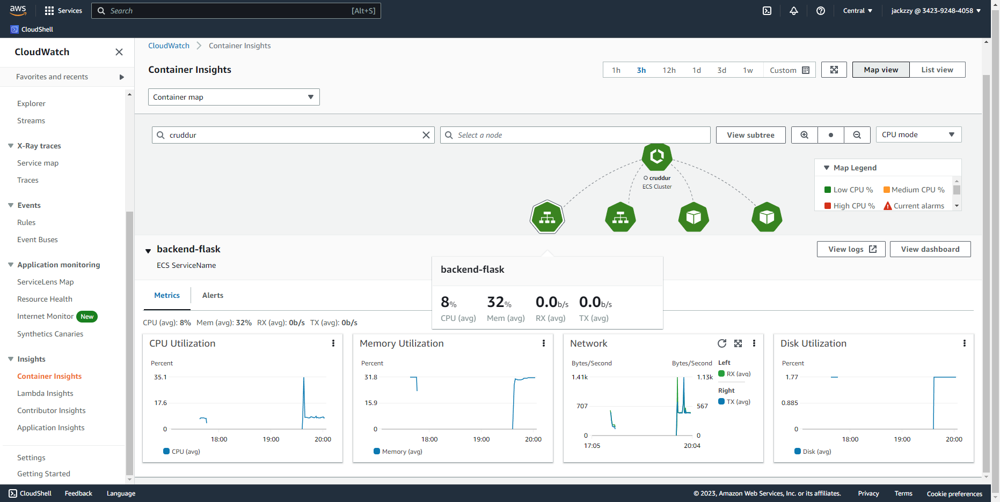
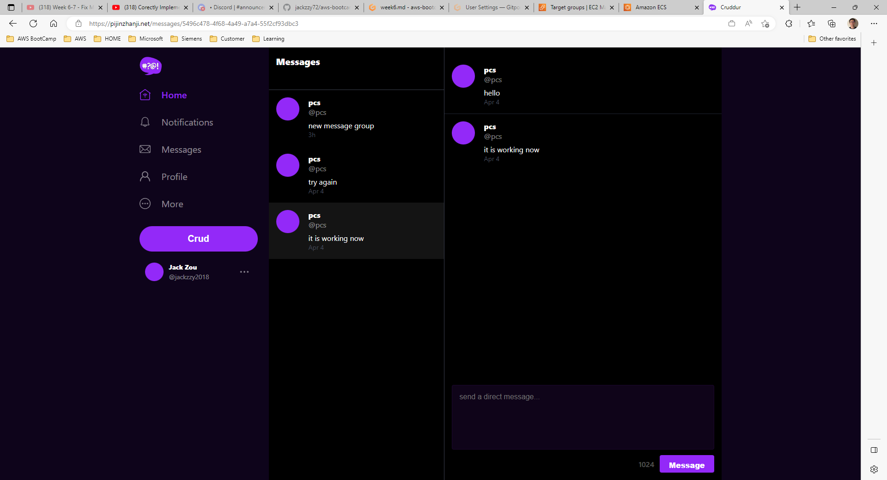
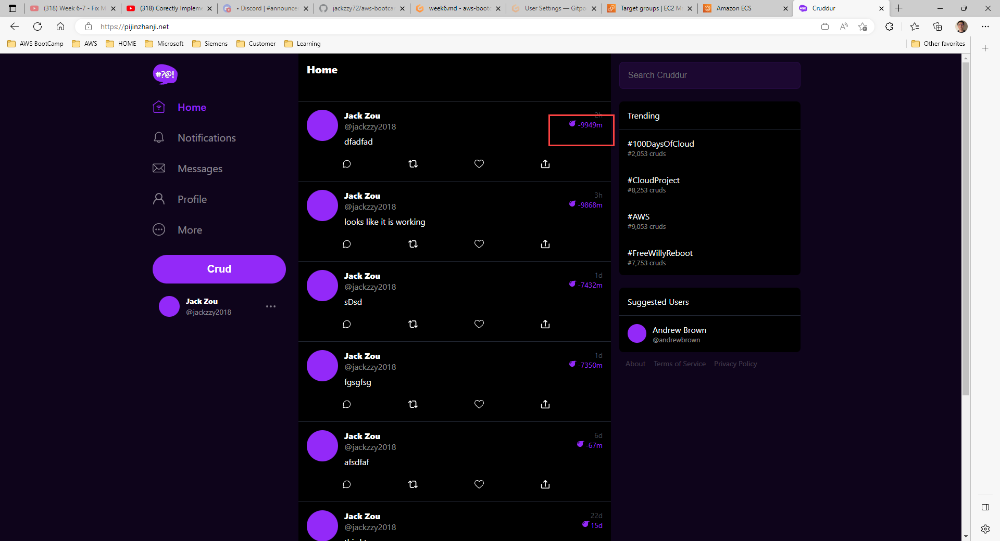

# Week 7 — Solving CORS with a Load Balancer and Custom Domain

### - Created services for `backend-flask` and `frontend-react-js` under the `cruddur` cluster on ECS.

### - Check services are all running healthy.

### - Check Load balancer and target group, both target group are healthy.

### - Configure task Definitions to contain x-ray and trun on Conainer insightes.

### - Setup Domain with Route 53 Website is up and running

### - Implement Refresh Token for Amazon Cognito

### - Move Bin directory to be at the top level

###  - Correctly implementing Timezones for ISO 8601, but still some bugs in the code display properly time. will troubleshooting in the future. no credit in gitpod.

