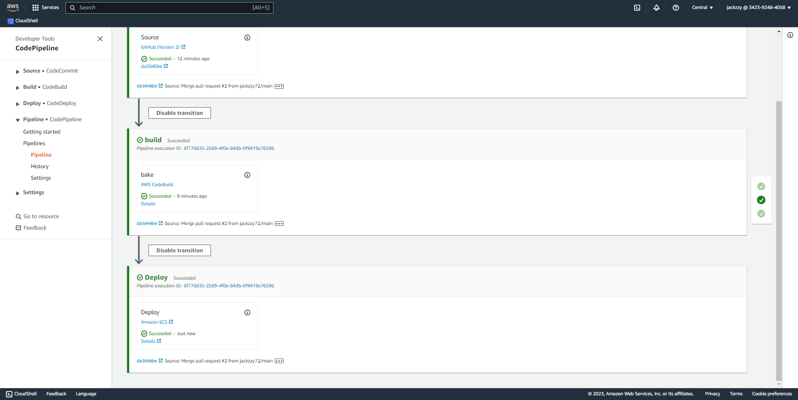
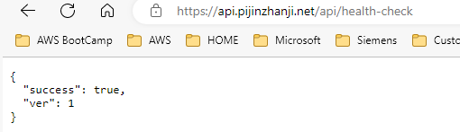

# Week 9 — CI/CD with CodePipeline, CodeBuild and CodeDeploy

### - Create branch "prod" in github, which will be used for codebuilder and code pipeline

### - Create Code build project - need buildspec.yml and attach policy ecr-codebuild-backendf-role

### - Create code Pipeline

### - Test code pipeline by modify code in backend-flask/app.py health check.

